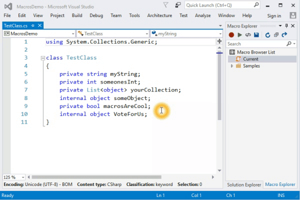
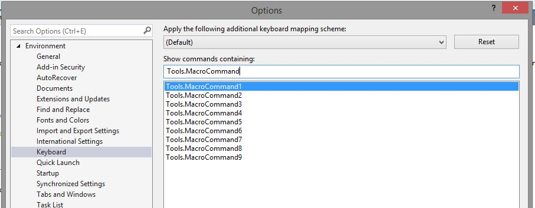
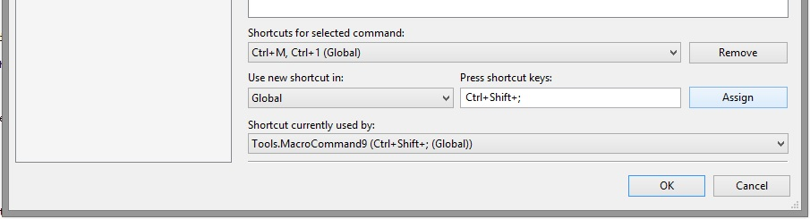

## [Not maintained]
This extension was originally created by a group of interns on the Visual Studio team. It is no longer maintained. 

# Macros for Visual Studio

An extension for Visual Studio that enables the use of macros to automate repetitive tasks in the IDE. The extension can record most of the commands in Visual Studio including text editing operations.

## Features

* Record and playback active document operations and Visual Studio IDE commands
* Playback multiple times
* Manage and persist macros with a Macro Explorer
* Assign keyboard bindings to any macro
* Macros recorded as JavaScript files that call VS DTE APIs
* Macro editing in Visual Studio with DTE IntelliSense
* Stop playback
* Sample macros

## Example

Suppose you wanted to convert the private variables in the following class to public fields.

    class TestClass
    {
        private string myString;
        private int someonesInt;
        private List<object> yourCollectionOfObjects;
        private bool macrosAreCool;
    }

To do so efficiently, place your cursor before the "p" of the first private then start recording a macro (CTRL+M, R). Select the next word, type in "public" then go to the end of the line, go back two words, select the first letter, make it uppercase (CTRL+SHIFT+U). Finally, go to the next line and place the cursor at the beginning of the line and stop recording (CTRL+M, R again).

You can then playback the macro (CTRL+M, Enter) or play it back multiple times (CTRL+M, I).

## Getting Started
To install the extension, download and run the VSIX available from the Marketplace at this link:
[https://marketplace.visualstudio.com/items?itemName=VisualStudioPlatformTeam.MacrosforVisualStudio](https://marketplace.visualstudio.com/items?itemName=VisualStudioPlatformTeam.MacrosforVisualStudio).
Alternatively, from within Visual Studio open `Tools > Extensions and Updates` and search for `Macros for Visual Studio`.

After installing the extension, the Macro menu will appear under `Tools > Macros`. Under this menu, you'll find commands to record and playback a macro.

### Current macro

The Current macro is a temporary macro that holds the last recorded macro. To persist it, use the Macro Explorer toolbar command `Save Current Macro` (or right-click the Current macro). Name the new macro and assign a shortcut if you wish.
The new macro will then be persisted on your file system.

### Assigning a shortcut

#### Predefined keyboard shortcut

To assign a shortcut to a macro, right-click the macro and then `Assign shortcut`. Select a shortcut from the list and hit `OK`.

#### Custom keyboard shortcut

To assign a custom keyboard shortcut like `CTRL+SHIFT+;` to a macro,

1. [Assign a predefined keyboard shortcut](#predefinedshortcut)
2. Go to `Tools > Options > Keyboard` (or click on "Assign custom keyboard shortcut" in the previous dialog).
3. Search for `Tools.MacroCommand#` where `#` is the number of the predefined shortcut you assigned your macro to.

    

4. Assign a custom shortcut to that command

    

### Sample macros

**Accessibility**

- Decrease Font Size
- Increase Font Size
- Maximize Tool Windows

**Documents**

- Close Except Active: close all files in Visual Studio except active file
- Headify All: insert header into each C# file in the solution
- Remove and Sort All: remove unused usings and then sort, for each C# file in the solution

**Editor**

- Beginning of Function: moves cursor to the beginning of the current function
- Insert Date & Time
- Insert Date
- Insert Header: insert header into current C# file
- Insert Time
- Pane Center Screen
- Pane Top Screen
- Save Backup: saves active document as .bak file in current directory

**Snippets (inserts code snippet)**

- For Each Document: to iterate through each open document in Visual Studio
- For Each Window: to iterate through each open window in Visual Studio
- Properties: grab one of the properties in Tools >> Options

    For example, to show/hide status bar:

                var property = dte.Properties("Environment", "General")
                property.Item("ShowStatusBar").Value = true

- Undo Context: encapsulate a single undo in macro script

**Utilities**

- Find Line: queries find tool for current line
- Toggle Line Numbers
- Toggle Word Wrap

## Caveats

The following are not supported by the extension right now:

- Recording interaction with dialogs
- Recording of 'async' commands like Build may not execute as expected
- Execute a macro inside another macro

## FAQ

* Can I playback macros from Visual Studio 2010?

No. Macros in this extension are written in JavaScript while macros in Visual Studio 2010 were written in VBA Macros.

If you want to use your old VBA macros, you'll have to manually convert them to JavaScript.

* How can I modify the shortcut to record, playback and playback multiple times?

Go to `Tools > Options > Keyboard` and search for `Tools.StartRecording`, `Tools.Playback`, `Tools.PlaybackMultipleTimes`.

* How can I assign a custom keyboard shortcut to a macro?

See [Assigning a custom keyboard shortcut](#customshortcut).

* How can I have my project macro folder in the Macro Explorer

The Macro Explorer displays all macros in its Macro Directory and its sub directories. You can open the Macro Directory by clicking the last blue arrow symbol. But if you create a Folder soft link there (using `mklink /D`), you can link to whichever folder you want and the Macro Explorer displays the content of your folder of choice, too. This makes it possible to have your macros in your project's version control.
