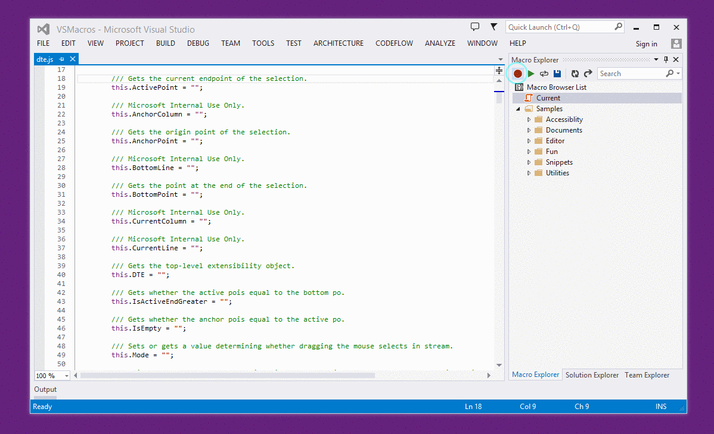
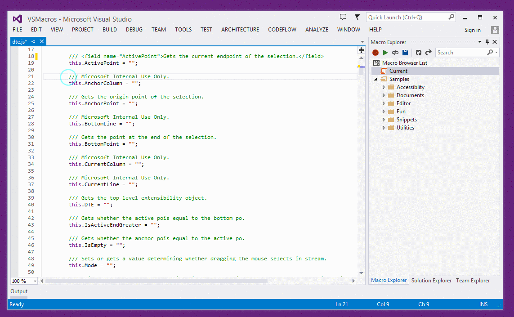

# Macros for Visual Studio

An extension for Visual Studio 2013 that enables the use of macros in the IDE. The extension can record most of the features in Visual Studio including text editing operations.

## Installation

1. Download and execute the VSIX file
2. Restart Visual Studio

## How To Use

The extension is available under `Tools > Macros`.

### 1. Record repeatable actions on the first line

### 2. Execute the macro 1 or more times

### 3. Manage your macros with ease

## Examples

### Remove and sort usings in all files in the solution

### Add a header to all files in the solution

### DTE IntelliSense in the macro editor

DTE is the top-level object in the Visual Studio automation object model.

So next time you need to submit for code review

Just remember to…

