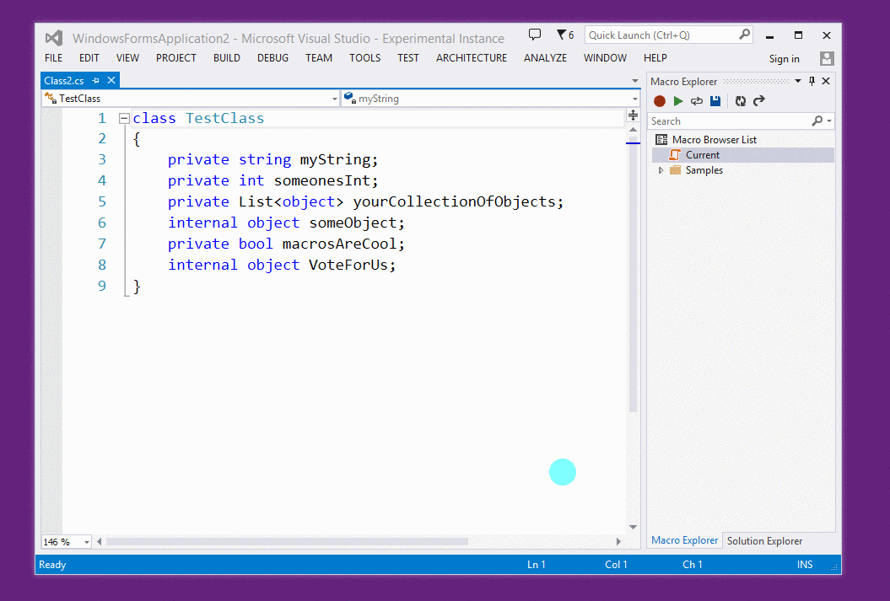
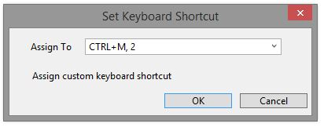

# Macros for Visual Studio

An extension for Visual Studio 2013 Professional (and above) that enables the use of macros to automate repetitive tasks in the IDE. The extension can record most of the features in Visual Studio including text editing operations.

## Features

* Record and playback active document operations and Visual Studio IDE commands
* Playback multiple times
* Manage and persist macros with a Macro Explorer
* Assign keyboard bindings to any macro
* Editing capability with JavaScript and DTE Intellisense
* Stop playback
* Sample macros

## Getting Started

After [installing](#install) the extension, the Macro menu will appear under `Tools > Macros`. Under this menu, you'll find commands to record and playback a macro.

### Current Macro

The Current macro is a temporary macro that holds the last recorded macro. To persist it, use the Macro Explorer toolbar command `Save Current Macro` (or right-click the Current macro). Name the new macro and assign a shortcut if you wish.
The new macro will then be persisted on your file system.

### Assigning a shortcut

#### Predefined keyboard shortcut

To assign a shortcut to a macro, right-click the macro and then `Assign shortcut`. Select a shortcut from the list and hit `OK`.

#### Custom keyboard shortcut

To assign a custom keyboard shortcut like `CTRL+SHIFT+;` to a macro, you'll first need to [assign a predefined keyboard shortcut](#predefinedshortcut). Then go to `Tools > Options > Keyboard` (or click on "Assign custom keyboard shortcut" in the previous dialog).
Look for `Tools.MacroCommand#` where `#` is the number of the predefined shortcut you assigned your macro to.

## Example

Suppose you wanted to convert the private variables in the following class to public fields.

    class TestClass
    {
        private string myString;
        private int someonesInt;
        private List<object> yourCollectionOfObjects;
        private bool macrosAreCool;
    }

To do so efficiently, place your cursor before the "p" of the first private then start recording a macro (CTRL+M, R). Select the next word, type in "public" then go to the end of the line, go back two words, select the first letter, make it uppercase (CTRL+SHIFT+U). Finally, go to the next line and place the cursor at the beginning of the line and stop recording (CTRL+M, R again).

You can then playback the macro (CTRL+M, P) or play it back multiple times (CTRL+M, I).

## FAQ

* How can I modify the shortcut to record, playback and playback multiple times?

Go to `Tools > Options > Keyboard` and look for `Tools.StartRecording`, `Tools.Playback`, `Tools.PlaybackMultipleTimes`.

* How can I assign a custom keyboard shortcut to a macro?

See [Assigning a custom keyboard shortcut](#customshortcut).

## Release Notes

**1.2.1 - 8/4/2014**

- Better DTE IntelliSense in editor

**1.2.0 - 7/29/2014**

- More sophisticated recorder output
- More descriptive error messages for certain errors
- Stop execution is enabled, along with toolbar changes during/after execution

**1.1.0 - 7/24/2014**

- Drag and Drop macros from Windows File Explorer to Macro Explorer
- Restore folder expansion in next session
- Better Intellisense handling by the recorder
- Improved execution engine and better error handling

**1.0.1 - 7/21/2014**

- More sophisticated command parsing
- Engine closes when Visual Studio closes
- More graceful error handling
- Ability to playback a macro multiple times

**1.0.0 - 7/18/2014**

- Initial release